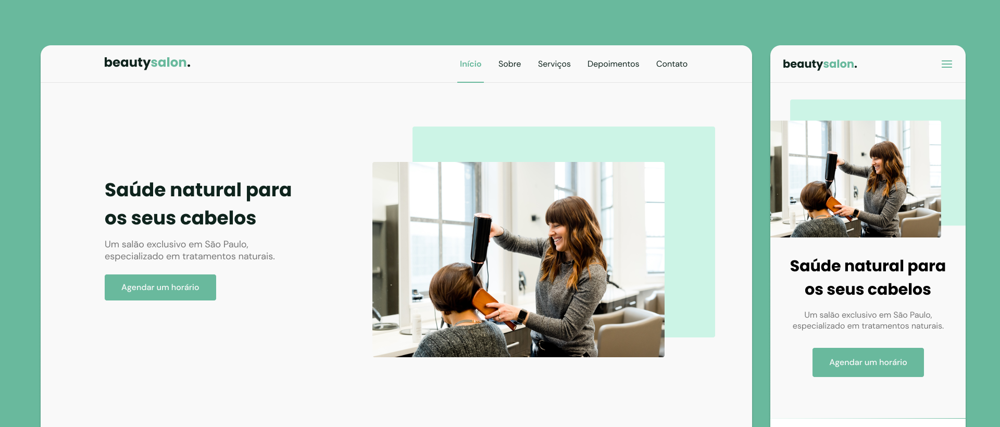

# [BeautySalon] (castilho-dev.github.io/beautysalon)

  

## Technologies

This project was developed with the following technologies:

- HTML5
- CSS3
- JavaScript

Libraries

- [Google Fonts](https://fonts.google.com/)
- [SwipeJS](https://github.com/nolimits4web/Swiper)
- [ScrollRevel](https://scrollrevealjs.org)

Utilities

- [IconMoon](https://icomoon.io/)

## Project

BeautySalon is ​​an institutional page in one page format, responsive, to be used in various types of micro, small and medium-sized companies. Contains the following sections:

- Header
- Navigation
- Home
- About
- Services
- Testimonials
- Contact
- Footer

## License

[MIT License](./LICENSE) © [Gabriel Castilho](http://instagram.com/castilho.dev)
